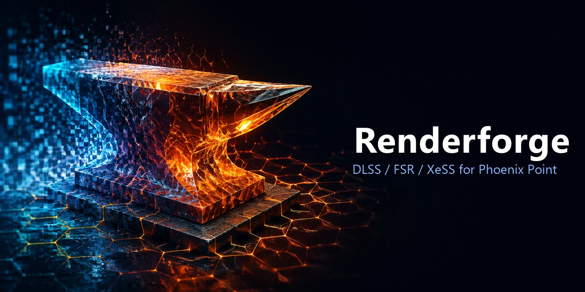

# Renderforge



[](https://github.com/UberMorgott/PhoenixPoint-Mod-Renderforge/releases/latest) [](https://github.com/UberMorgott/PhoenixPoint-Mod-Renderforge/releases/latest) [](https://github.com/UberMorgott/PhoenixPoint-Mod-Renderforge/stargazers) [](https://steamcommunity.com/sharedfiles/filedetails/?id=3796708495) [](https://github.com/UberMorgott/PhoenixPoint-Mod-Renderforge/issues/new/choose) [](LICENSE)

Renderforge is a Phoenix Point mod for Windows that adds modern image reconstruction, sharpening, frame generation, frame-rate controls, and a useful performance overlay. Phoenix Point is a Unity game that normally uses Direct3D 11; Renderforge keeps that path and also makes an experimental Direct3D 12 path available for features that need it.

## What it does

- **DLSS Super Resolution** provides Auto, Quality, Balanced, Performance, and Ultra Performance modes on supported NVIDIA RTX GPUs.
- **DLAA** uses DLSS at native resolution for anti-aliasing instead of upscaling.
- **FSR upscaling** provides cross-vendor upscaling and a native-resolution AA mode under Direct3D 12; the shipped AMD runtime runs FSR 4.1.1 on RDNA 3/4 and falls back to FSR 3.1.5 elsewhere.
- **XeSS upscaling** runs on modern GPUs under Direct3D 12 and includes its additional Ultra Quality modes.
- **Live upscaler switching** lets you move between DLSS, FSR, and XeSS while playing, without restarting the game.
- **Frame Generation** supports DLSS-G, FSR Frame Generation, and XeSS-FG under Direct3D 12: 2x everywhere it runs, and up to 4x with DLSS-G on RTX 50.
- **NVIDIA Image Scaling sharpening** adds a separate 0–100 sharpness control (default 40), with 0 disabling the pass. Since 1.4.1 the sharpness slider is always enabled: setting Mode Off with Sharpness above 0 runs NIS on the vanilla frame while preserving the game's own anti-aliasing.
- **LUT filters** add nine original live colour grades after temporal reconstruction, in tactical missions and on the Geoscape: Realistic Desaturated, Neutral, Cinematic Bleach, Vivid, B&W Cinema, Noir, Amber Film, Arctic, and Vintage Sepia, with a 0–100 strength control and no bundled third-party assets. The interface stays ungraded.
- **Automatic mip bias** keeps textures appropriately detailed when the game renders below the output resolution.
- **Scene styles** provide Cartoon and PixelArt with live strength controls. PixelArt defaults to 4-pixel blocks and a moderate palette; block size remains adjustable from 2 to 16 actual output pixels. The filters run after reconstruction and preserve the output-resolution interface.
- **Colour vision correction** offers Deuteranopia, Protanopia and Tritanopia daltonization in tactical missions and on the Geoscape, at full fixed strength, composed on top of any LUT filter or scene style. It redistributes the colours the eye cannot separate onto the channels it can, using the Machado et al. (2009) simulation matrices. The correction applies to the **scene only** — the interface is composited after this pass and is not corrected.
- **Image sliders** add ReShade-style Exposure, Black point, White point, Brightness, Contrast, Clarity, Vibrance and Saturation in the same post pass, live in tactical missions and on the Geoscape, all at identity by default. Clarity is a luma unsharp mask against a 13-tap Poisson blur (local contrast on fine detail). Scene only; the HUD stays unchanged. Every tooltip states the default, and one **Reset image settings** button returns Sharpness, LUT strength and all eight sliders to their defaults (the LUT filter, colour vision and scene style selections stay).
- **Pixel-perfect UI** (off by default) snaps the interface to the pixel grid (`Canvas.pixelPerfect` on the root overlay canvases): measurably sharper text at 1440p, but animated panels may move in whole-pixel steps. Applies live, no restart.
- **Frame-rate control** removes the vanilla 60 FPS pin and can optionally apply a 30–300 FPS limit.
- **Resolution list without refresh-rate duplicates:** one entry per size in Options → Screen, highest refresh rate kept.
- **Benchmark overlay** toggles with `Ctrl+Alt+O` and shows the renderer, upscaler, mode, resolution, frame time, real FPS, and presented FPS when frame generation is active.
- **Eight languages.** Every Renderforge row, value and tooltip follows the game's language setting: English, Russian, Chinese (Simplified), French, German, Italian, Polish and Spanish. Tooltips state where each row works (renderer, upscaler needed, scene only, restart). Strings live in `src\Localization\strings.csv`; corrections are welcome as pull requests.
- **Direct3D 12 launch fix** makes the game's otherwise broken `-force-d3d12` path usable; ambient occlusion keeps running there in SAO mode and colour grading uses a 2D LUT.
- **Native in-game settings** add renderer, upscaler, frame generation, quality, and sharpness controls, with unsupported choices greyed out and tooltips explaining why.

The tactical and geoscape scenes are reconstructed; the interface remains at the output resolution. Renderforge also disables SMAA while an upscaler is active to avoid stacking two anti-aliasing passes.

## Requirements

- Windows and Phoenix Point.
- A current graphics driver is strongly recommended.
- The Steam version and the PPModEnabler/Doorstop path used by non-Steam Windows releases are supported.

| Feature | GPU | Renderer |
|---|---|---|
| DLSS Super Resolution / DLAA | NVIDIA GeForce RTX | D3D11 or D3D12 |
| DLSS-G frame generation | NVIDIA GeForce RTX 40 series or newer (2x; up to 4x on RTX 50) | D3D12 |
| FSR upscaling | Any modern GPU | D3D12 |
| FSR Frame Generation 2x | Any modern GPU | D3D12 |
| XeSS upscaling | Any modern GPU | D3D12 |
| XeSS-FG frame generation 2x | Any modern GPU | D3D12 |
| NIS sharpening, LUT filters, colour vision, mip bias, FPS controls, overlay | Any supported GPU | D3D11 or D3D12 |
| Analytic post pass without an upscaler | Verified on NVIDIA (RTX); non-NVIDIA / GTX pending smoke-test | D3D11 or D3D12 |

Phoenix Point starts in D3D11 by default. To use D3D12, choose **DirectX 12 (experimental)** under **Options → Graphics → Renderer**, press **Apply**, and accept the restart. Renderforge preserves the existing command line and relaunches the game with `-force-d3d12`. With PPModEnabler on GOG or Epic, the relaunch also resets Doorstop's inherited process marker so the mod loader and enabled mods start normally.

No launcher options or file edits are required. On a later normal launch, Renderforge automatically performs one quick restart if the saved renderer is D3D12; it does not show a restart question unless you actually change the renderer. Select DirectX 11 in the game to return to the default renderer.

## Install

Download `Renderforge-Full-<version>.zip` from the [latest GitHub release](https://github.com/UberMorgott/PhoenixPoint-Mod-Renderforge/releases/latest). It is a single archive with one top-level `Renderforge` folder and carries every vendor runtime (NVIDIA, AMD, Intel) — nothing else to pick.

With a mod manager, add that archive. For a manual install, extract it into:

```text
<Phoenix Point>\Mods\
```

The result should begin like this:

```text
Mods\Renderforge\
  Renderforge.dll
  RenderforgeNative.dll
  meta.json
  README.md
```

Vendor DLLs and their license files sit beside those files. Do not create an extra nested `Renderforge\Renderforge` folder, and do not install a vendor pack without Core.

Start Phoenix Point with mod support enabled, open **Main menu → Mods**, enable **Renderforge**, and restart the game once. On the first enabled launch, Renderforge copies `RenderforgeNative.dll` to `PhoenixPointWin64_Data\Plugins\x86_64\`; Unity can only provide the D3D12 plugin interface after that staged copy is loaded on the next start. The same one-time restart may be needed after an update.

## Settings

The regular controls live only in the normal game menus: renderer, upscaler, quality, frame generation, sharpness, LUT filter, LUT strength, colour vision, exposure, black/white point, brightness, contrast, clarity, vibrance, saturation, the reset button and scene styles are under **Options → Graphics**; the FPS limiter and pixel-perfect UI are under **Options → Screen**. They are deliberately not duplicated under **Mods → Renderforge**, which contains only overlay and hotkey preferences. Developer diagnostics are runtime-only and always reset to the production-tested values when the mod starts.

| Setting | Default | Notes |
|---|---:|---|
| Renderer | Auto | Auto uses D3D11; changing renderer requires a restart. |
| Upscaler | Auto | Picks an available provider for the current GPU and renderer. |
| Quality | Auto | DLAA through 1200p, Quality through 1600p, and Performance above 1600p. |
| Frame generation | Off | 2x on a supported D3D12 setup with an upscaler active; 3x and 4x need DLSS-G on an RTX 50 GPU and are greyed out otherwise. |
| Sharpness | 40 | Live 0–100 control; 0 disables sharpening. |
| LUT filter | Off | Nine colour grades, including B&W Cinema, Noir, Amber Film, Arctic and Vintage Sepia, in tactical missions and on the Geoscape. Runs after reconstruction so it never enters temporal history; the HUD stays unchanged. |
| LUT strength | 100 | Live 0–100 blend from the original image to the selected grade. |
| Scene style | Off | Cartoon or PixelArt; live 0–100 strength, default 100. This is screen filtering, not a geometry replacement. |
| Pixel block size | 2 | Actual output pixels; adjustable from 2 to 16. |
| Colour vision | Off | Deuteranopia, Protanopia or Tritanopia correction in tactical missions and on the Geoscape, at full strength. Scene only: the HUD and menus are drawn after this pass and stay uncorrected. |
| Exposure | 0 | -40–40 in tenths of a stop (10 = +1 EV = twice the linear light); first stage of the chain. Live, scene only. |
| Black point | 0 | Input black level, 0–40: pixels darker than this become black and the rest stretch (deeper shadows); 0 = off. Live, scene only. |
| White point | 255 | Input white level, 215–255: pixels brighter than this become white (brighter highlights); 255 = off. Live, scene only. |
| Brightness | 0 | -100–100 midtone gamma (`pow(c, 2^-B)`): black and white stay put, above 0 lifts the mids, below 0 sinks them. Live, scene only. |
| Contrast | 100 | 50–150, pivots at mid-grey; 100 = off, below flattens, above deepens (dark scenes get darker). Live, scene only. |
| Clarity | 0 | Local contrast on fine detail (luma unsharp mask, ~10 px radius at 1080p), 0–100; 0 = off. Live, scene only. |
| Vibrance | 0 | -100–100 saturation gain weighted towards muted colours (vivid ones barely move); below 0 mutes. Live, scene only. |
| Saturation | 100 | 0–200 blend from luma (0 = greyscale) through as-rendered (100) to double (200). Live, scene only. |
| Reset image settings | — | Button: Sharpness, LUT strength and the eight sliders above back to their defaults; LUT filter, colour vision and scene style selections untouched. |
| Vignette | Vanilla | Vanilla keeps the game's own vignette; Off removes the darkened frame edges, in tactical missions and on the Geoscape. |
| Shadow resolution | Vanilla | Vanilla keeps the graphics preset's value; Very High raises the shadow map size. |
| Anisotropic filtering | Vanilla | Vanilla leaves per-texture filtering alone; 16x forces 16 samples on every texture. |
| LOD detail | 0 | 0 is Vanilla (the preset's own value); 1.0 to 4.0 keeps higher-detail models at distance. |
| Pixel-perfect UI | Off | `Canvas.pixelPerfect` on every root screen-space overlay canvas (nested canvases inherit). Snaps interface elements to the pixel grid: sharper text at non-native UI scales (measured +2–7% edge contrast at 1440p); animated panels may move in whole-pixel steps. Live, no restart; camera/world canvases untouched. |
| Frame-rate limit | Off | Caps final presented FPS, including generated frames; enabling it disables VSync. |
| Max presented FPS | 60 | Used only when the Renderforge limit is enabled; range 30–300. A live 2x/3x/4x FG chain automatically renders at 1/2, 1/3 or 1/4 of this ceiling. |
| Benchmark overlay | Off | Toggle with `Ctrl+Alt+O`; default position is top centre. |

### Quality knobs

Four settings the game itself never exposes, in **Options → Graphics**. Every one has a **Vanilla** position that restores the value the game's own graphics preset had set — switching a knob off does not leave the mod's value behind, and changing the graphics preset does not lose your choice.

| Row | Values | What it does |
|---|---|---|
| Vignette | Vanilla / Off | Removes the darkened frame edges, in tactical missions and on the Geoscape. |
| Shadow resolution | Vanilla / Very High | Raises the shadow map size above the preset's own tier. |
| Anisotropic filtering | Vanilla / 16x | Forces 16 samples on every texture — sharper ground and walls at grazing angles. |
| LOD detail | 0 (Vanilla) / 1.0 … 4.0 | Keeps higher-detail models at distance. |

Measured on an RTX 5070 Ti at 1440p in a 153-actor tactical scene at ~240 FPS: the costliest knob (Aniso 16x) adds ~8 pp GPU utilization; no knob measurably affects frame time or VRAM on this GPU. All knobs default to Vanilla.

`Ctrl+Alt+U` toggles the current upscaler off and back on. The letter keys for both shortcuts, the overlay position and scale, and the option to show Renderforge rows in Graphics settings can be changed under **Mods → Renderforge**.

## Known issues / notes

- Under D3D12 ambient occlusion runs in SAO mode instead of MSVO, and HDR colour grading uses a 2D LUT instead of the ACES 3D LUT.
- Changing resolution while running D3D12 can make DLSS report a platform error and switch itself off.
- A few frames after changing quality or upscaler may be unscaled while Renderforge releases and recreates its resources.
- Frame generation is intended for windowed or borderless mode; exclusive fullscreen tears down the frame-generation chain.
- DLSS-G generates frames only while the game window is in the foreground and resumes when focus returns.
- The Steam overlay touches the same presentation path used by frame generation; the current build guards against recursive hooks, but disabling the overlay is a useful first check if frame generation crashes.
- Frame generation can add latency and may show artefacts during fast camera movement, so it is off by default.
- Tactical missions under D3D12 were dark before 1.3.0; the mod now ships its own D3D12 copies of the auto-exposure shaders, so this is fixed.
- A D3D12-only upscaler (FSR or XeSS) left selected while running D3D11 used to disable the entire post pass (LUT, scene styles, colour vision) until the upscaler was changed; fixed in 1.4.1 by falling back to Auto on D3D11.
- Since 1.4.1 the analytic post pass (LUT grades, scene styles, colour vision correction, NIS sharpening) runs even when no upscaler can initialise: the native shim reports `DLSS_OK_POST_ONLY`, the mod keeps a permanent passthrough generation carrying the post pass, vanilla SMAA is preserved, and the upscaler row greys out with the real reason. Verified on NVIDIA (RTX 5070 Ti) under D3D11 and D3D12 with NGX failures both faked and forced; non-NVIDIA and GTX hardware is expected to work but has not yet been smoke-tested. On D3D12 the auto-fallback chain (FSR, then XeSS, then post-only) is preserved.
- **For other mod authors.** While an upscaler is active the game camera renders into a lower-resolution texture: `Camera.pixelWidth/pixelHeight` report the render resolution, while `Screen.width/height` and `Camera.WorldToScreenPoint` stay in backbuffer pixels. Overlays that mix the two (for example `GL.LoadPixelMatrix(0, cam.pixelWidth, ...)`) will be drawn at the wrong scale; use `Screen.*`. Immediate-mode `GL` geometry drawn during the camera pass (`OnPostRender` / `OnRenderObject`) carries no motion vectors and will ghost under DLSS/FSR/XeSS; draw such overlays from `OnGUI` or otherwise after the camera has finished.

The discontinued DLSS 5 / face-reconstruction experiments are documented in the [retirement dossier](docs/research/2026-09-05-dlss5-retirement-dossier.md). Their runtime, controls and experimental face tools are removed. Older configuration files remain readable: obsolete experiment keys are ignored and disappear on the next normal settings save; unrelated settings are retained.

If you report a frame-generation problem, include `Mods\Renderforge\renderforge_fg.log`. For general D3D12 or upscaler problems, include the game's `Player.log` and any NGX log files written beside the mod.

## Building from source

You need Windows, the .NET 8 SDK, Visual Studio 2022 Build Tools with the x64 C++ toolchain, CMake, and a Phoenix Point installation. The build expects the NVIDIA DLSS and Streamline, AMD FidelityFX, and Intel XeSS SDKs in the workspace's `refs\` directory (`..\refs\` from this repository). Their code and redistributable binaries remain covered by the vendor license files included here.

```powershell
dotnet build Renderforge.csproj -c Release /p:PPRoot="<Phoenix Point install>"
.\build-native.ps1
.\build\release.ps1 -PPRoot "<Phoenix Point install>"
```

The last command builds the release archives in `build\release\`: Core, NVIDIA, AMD, Intel, and Full zips, plus `SHA256SUMS.txt`. `deploy.ps1` is available for a local development install; the release process is described in [`docs/RELEASING.md`](docs/RELEASING.md).

Copy `Directory.Build.props.example` to `Directory.Build.props` (gitignored) and set `PPRoot` there to build without `/p:PPRoot`. `dotnet test tests\Renderforge.Tests` runs the Unity-free unit tests (CSV parser, string table, `strings.csv` contract); they compile the sources directly and need no game install.

## Credits & licenses

Renderforge is created by **Morgott** and uses the mod ID `com.morgott.Renderforge`.

- Renderforge © 2026 Morgott. [CC BY-NC 4.0](https://creativecommons.org/licenses/by-nc/4.0/) ([LICENSE](LICENSE)) — free to use and modify for non-commercial purposes with attribution.
- NVIDIA DLSS and Streamline are covered by [LICENSE-NVIDIA.txt](LICENSE-NVIDIA.txt).
- NVIDIA Image Scaling is covered by [LICENSE-NIS.txt](LICENSE-NIS.txt).
- AMD FidelityFX (FSR upscaling and frame generation) is covered by [LICENSE-AMD.txt](LICENSE-AMD.txt).
- Intel XeSS is covered by [LICENSE-INTEL.txt](LICENSE-INTEL.txt).
- Harmony provides the runtime patching layer through Phoenix Point's ModSDK.

NVIDIA, AMD, Intel, Snapshot Games, and their product names and trademarks belong to their respective owners. Renderforge is an independent community mod and is not endorsed by those companies.
