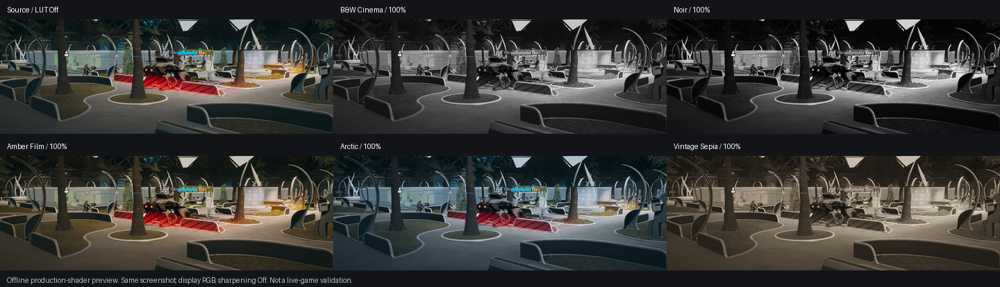

# Original cinema grades

- Added B&W Cinema, Noir, Amber Film, Arctic and Vintage Sepia using only original HLSL formulas. Existing presets and the default `Off` are unchanged. Full-strength B&W presets remove chroma; lower strength intentionally blends source colour back in.
- No LUT textures, model weights or runtime assets: asset-size delta **0 bytes**. The Release native DLL grows from 234,496 to 235,008 bytes; the isolated Release managed DLL from 140,288 to 140,800 bytes (**1,024 bytes combined**). Debug symbols and this development preview are not runtime LUT assets.
- Existing tactical-only gate and the single post-reconstruction RCAS/grade pass remain unchanged. No game setting was changed, no live game was restarted, and these builds were not deployed.



## Preview provenance

- Input: `E:\DEV\PhoenixPoint\Renderforge\build\lut-proof\verified-syn-day-off.png`, an existing 1280×720 game capture with LUT Off. Source SHA-256 and exact crop are recorded in [contact-sheet.json](lut-cinema-pack/contact-sheet.json).
- Every tile uses the same central `(0,100,1280,540)` crop, resized to 480×165 before applying the production shader. Strength 100%, sharpening 0; the first tile is the unchanged source reference.
- Actual compiled HLSL executes on D3D11 WARP against normalized display RGB in an FP32 texture, then clamps to the PNG display range. This is an offline screenshot demonstration. It also grades any HUD already baked into the crop; the live pipeline runs before UI composition. It does not prove live menu cycling, D3D12 presentation or the look of FP16-linear output.

## Verification

```powershell
& 'C:\Program Files\CMake\bin\cmake.exe' --build build/native --config Release --target RenderforgeNative lut_probe -- /verbosity:minimal
.\build\native\Release\lut_probe.exe
python native/probe/preview_luts.py build/lut-proof/verified-syn-day-off.png build/native/Release/lut_probe.exe docs/lut-cinema-pack/contact-sheet.png --work D:/RenderforgeWork/lut-pack/preview
dotnet build D:/RenderforgeWork/lut-pack/managed/Renderforge.csproj -c Release '/p:PPRoot=D:\Steam\steamapps\common\Phoenix Point' -v:q
```

- Native Release build passed. Probe: `PASS: production HLSL on D3D11 WARP; 9 presets; 4913-color cube; alpha, finite range, blend endpoints, B&W equality, 1025-step monotonic ramps, FP overbrights.` The cube dimensions 17×289 and ramp width 1025 also exercise partial thread groups and readback row pitch.
- Managed build: **0 warnings, 0 errors**, using a snapshot of tracked source plus the LUT edits under `D:\RenderforgeWork\lut-pack\managed`. This isolates concurrently unfinished scene-stylization source in the shared checkout.
- Initial probe compilation lacked `<string>`; added it. Initial exact B&W float equality was too strict for `lerp` rounding; channel differences are checked at `1e-6`, far below an 8-bit display step. The production shader required no correction for that test.
- All temporary files were directed to `D:\RenderforgeWork\lut-pack`; no dependencies or images were downloaded.

Undo the appearance with **LUT filter → Off**. Binary deployment and live-game acceptance remain a separate step.
