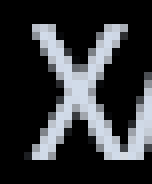
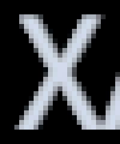
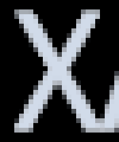

# Production font core: live 1440p and calibrated offscreen 2160p

The production correction from commit `28e9deb3f6d93b867bbd5c16a1dfd2433146219f` passed a source-linked live 1440p comparison. An isolated UI render then reproduced the same SourceHanSans letter closely at 1440p and produced genuine 3840×2160 RenderTexture captures. **The 2160p images are offscreen UI, not a 4K frame of the running game.** The game remained2560×1440 throughout this additional experiment.

## Same letter before and after

Assigned font: SourceHanSans-Medium; actual caption: `ХАРАКТЕРИСТИКИ`; public font size32 and normal style in every image. Each native letter crop is shown at exactly8× through integer pixel replication; every replicated output pixel was checked against its source. No1440p image was enlarged into a purported2160p render.

| Actual render | Original A1 | Corrected B |
|---|---|---|
| **Game screen2560×1440**, Canvas scale0.6666667 |  |  |
| **Offscreen UI3840×2160**, Canvas scale1; game still1440p |  |  |

The letter is sharper with unchanged positions within each before/after pair. The larger2160p crop reflects a newly rasterized glyph at the larger UI scale, not an interpolation of the1440p crop. A2 restored the primary native letter crop byte-for-byte in the game, offscreen1440p and offscreen2160p.

## Production code, not a divergent approximation

- `D:\RenderforgeWork\fonts-final-proof\FontsProbe.csproj` compiles the actual repository `src/FontRasterCorrection.cs` and `src/FontGlyphMapping.cs` through `Compile Include` links. The probe does not contain another copy of their algorithm. It invokes the production core directly; production Overlay-only eligibility remains in `CrispFonts` and was not loosened to permit the offscreen camera.
- Live A1/B/A2 used actual game Text instances1199684/1211890, SourceHanSans `ХАРАКТЕРИСТИКИ` and Purista Semibold `ВЫНОСЛИВОСТЬ`. Both improved with exactly zero change to preferred width/height, emitted screen vertices, lines, characters and quads. Two explicit wrapped/rich-text/best-fit fixtures fell back safely, retaining original geometry. See the earlier [stage2 report](2026-09-05-font-render-only-proof.md) for the mechanism and safety limits.
- These runs prove the production **core**. They do not claim that the final settings toggle/lifecycle wrapper or a newly deployed production DLL was exercised by this isolated harness.

## Offscreen calibration before extrapolation

- The probe copied only Text data: actual Font references, caption, public size/style, color, material, spacing, best-fit/overflow/alignment, pivot, rect and effective parent scale. It did not clone game objects or their behaviours. A dedicated disabled camera rendered the owned UI canvas explicitly to an owned RT.
- Actual source CanvasScaler: reference3840×2160, ScaleWithScreenSize, MatchWidthOrHeight0. Installed `CanvasScaler.HandleScaleWithScreenSize` uses `canvas.renderingDisplaySize`. The diagnostic therefore attaches no CanvasScaler: it evaluates the same source formula with the owned RT dimensions and sets only the diagnostic Canvas scale. Observed values:0.6666667 at2560×1440,1 at3840×2160. Root canvas rect remained3840×2160. Actual source `pixelPerfect` wasfalse and was preserved.
- The new ScreenSpaceCamera canvas matched both source captions'1440p preferred dimensions, density and screen-space vertex positions exactly. Camera pixel dimensions/rect and RT dimensions independently confirmed2560×1440 for calibration.
- On the primary SourceHanSans `Х` crop, **437 native pixels**, original offscreen-vs-game RGBA8 difference: maximum3/255, mean0.0744 per channel. Corrected comparison: maximum2/255, mean0.0624. This is a close raster/blend calibration, not a claim of bit-identical render paths. [Calibration data](font-final-proof-2026-09-05/calibration2k.json) retains all phases.
- Purista's actual game caption has a dark translucent panel; the isolated render uses a black clear background. Its geometry matches, but its composite RGBA comparison does not (maximum40/255). Purista's isolated images are retained onD: as supplementary evidence, **not** presented here as a fully calibrated match to the game panel.

## Genuine offscreen3840×2160

- The owned RenderTexture was3840×2160, ARGB32, sRGB, one sample, with24-bit depth. `camera.pixelWidth/Height` and `camera.pixelRect` were3840×2160; the readback PNGs were3840×2160. `Camera.Render` generated each frame into that RT and `ReadPixels` read it directly. No screenshot resampling generated these targets.
- Both assigned fonts retained public sizes32/36, with pixelsPerUnit1 at2160p; both corrected successfully. Original/B/A2 preferred dimensions, positions, line starts, visible characters and quad counts stayed exact. The12 offscreen samples across two resolutions/two fonts/three phases passed the [layout/error checks](font-final-proof-2026-09-05/offscreen-layout.json).
- This models isolated UI rasterization under the observed3840-reference scaling rule. It does not demonstrate a full4K scene, actual4K game display, all game panels or every fallback font. Direct FullScreenWindow and Windowed4K requests had already been refused/clamped by the current2560×1440 output path; that limit remains honestly recorded in the stage2 report.

## Verification and cleanup

- `dotnet build D:\RenderforgeWork\fonts-final-proof\FontsProbe.csproj -c Release -v:q --ignore-failed-sources` →0warnings,0errors.
- `check-offscreen-layout.ps1` → `PASS: 12 samples, exact preferred dimensions/vertices/line starts, no errors`. `zoom-letter.ps1` passed exhaustive integer8× pixel replication for both fonts in all three evidence sets.
- Core source SHA256: FontRasterCorrection `1C9BEBBBE526A85B4C1D0565C3850CE511A5AD92A6C56371B58F5A5B5C216254`; FontGlyphMapping `E979BFF73BE60BC7174A306788629307E265A053509E1A69E87D59E25DF0FE91`. Executed source-linked assembly SHA256 `B1E2D69C871F1343EA41B627441C0D36CBF7684C8F91131572188C2B655E47F8`.
- Owned camera/canvas/probe/fixture GameObjects returnednull after cleanup; Harmony owners were removed, owned RTs released, previous active RT restored, and the production core reported cache0. Separate watchdogs and `finally` cleanup covered failures. Shared font glyph caches need not shrink.
- Final game state: PID44280, geoscape/Playing, timeScale1,2560×1440 FullScreenWindow, actual DLSS output RT2560×1440, all Renderforge config fields exactly equal to the initial snapshot. No save/load, restart, OS display change, shutdown or production deployment occurred in this experiment.
- Full native targets, metrics, native letter crops,8× crops and reproduction scripts remain under `D:\RenderforgeWork\fonts-final-proof\{game2k-production,offscreen2k,offscreen4k}`. `final-restored.json` records the final settings/Screen/RT check. No fonts, models or external dependencies were downloaded or redistributed.
