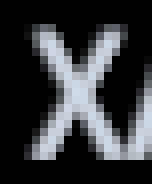
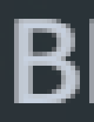
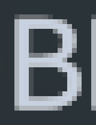

# Render-only font density: exact-layout 1440p proof

The second isolated experiment made two actual game captions visibly sharper at 2560x1440 while retaining their original preferred dimensions and every emitted vertex position exactly. It leaves the public text generator and layout path at normal density. Complex diagnostic captions that failed glyph mapping stayed original. This is evidence for a guarded option, not evidence that every font or caption can be improved.

Stage1 history remains in [2026-09-05-font-supersampling-probe.md](2026-09-05-font-supersampling-probe.md). Its global getter multiplier is not used here.

## One correction variant

- The installed `Text.OnPopulateMesh` generates the original mesh first. A scoped postfix takes a private copy of its vertices, colors and normal generator metadata, then uses a separate cached `TextGenerator` with `GetGenerationSettings(rect.size).scaleFactor * 2` for high-density glyph coverage. The original `pixelsPerUnit`, `cachedTextGenerator`, `cachedTextGeneratorForLayout`, public font size and Canvas scale are never overridden.
- High-density `uv0` replaces only the copied original `uv0`, provided native generation succeeds and character/visible/quad counts, line starts, doubled generated font size, rich-text colors, quad orientation, degenerate boxes and bounded glyph dimensions agree. Positions and all other original vertex attributes remain unchanged. Unsupported mapping returns the original caption, rather than moving/reordering/stretching arbitrary glyphs.
- Installed `Text.FontTextureChanged:330–349` calls `UpdateGeometry` synchronously while Canvas layout/graphics rebuilds. Installed `Graphic.DoMeshGeneration:441–459` uses shared `s_VertexHelper`, then runs `IMeshModifier` after `OnPopulateMesh`. High-density atlas allocation can therefore reenter another mesh generation immediately. The probe copies the original vertices before allocation, blocks recursive correction and reconstructs the output from private data. If an atlas event occurred during generation, it reruns the original normal mesh path under that guard for fresh UVs. It does not reuse UVs from a repacked atlas or suppress Unity font callbacks.
- Atlas events invalidate the private generators. One bounded refresh after initial warm-up handles static labels that deliberately fell back during allocation. There is no per-frame dirty loop. Probe disposal releases private native text generators through the installed explicit `IDisposable` implementation; shared Font atlases may remain expanded.
- A separate Harmony owner, exact Text instance whitelist, 180-second watchdog and runner `finally` provide cleanup. Other `Text.OnPopulateMesh` patch owners cause refusal. Existing UI mesh effects remain downstream in Unity's original order.

## Actual run

Fresh PID44280, manual save reported by the game's log as `22222.zsav`, geoscape/Playing. The user named the save with six twos; the diagnostic did not load, save or rename it. Fresh census and native screenshot identified the current roster UI; old process IDs/labels were not reused.

| Text instance | Actual caption / assigned font | Public size / Canvas scale | B result |
|---|---|---|---|
| 1199684 | ХАРАКТЕРИСТИКИ / SourceHanSans-Medium | 32 / 0.6666667 | Corrected; generated raster size21→42 |
| 1211890 | ВЫНОСЛИВОСТЬ / Purista Semibold | 36 / 0.6666667 | Corrected; generated raster size24→48 |
| −208352 | Temporary wrapped/color/bold/italic fixture / SourceHanSans-Medium | 32 / 0.6666667 | Original fallback: glyph box mismatch |
| −208382 | Temporary wrapped/color/bold/italic/best-fit fixture / Purista Semibold | 40 / 0.6666667 | Original fallback: glyph box mismatch |

All four retained exact original settings, preferred width/height, screen-space vertices, visible character counts and quad counts through A1→B→A2. Both real captions retained line start `[0]`; the fixtures retained `[0,54,82]` and `[0,54,72,101]`. The fixtures are clearly labelled `FONT DIAGNOSTIC` and do not represent existing game captions. Their unchanged fallback is a safety result, not a quality improvement claim.

Actual `Screen.width/height`, DLSS color/depth/motion/output RenderTextures and native PNG dimensions were all **2560×1440**. Both captions use `UnityEngine.UI.Text` and a `ScreenSpaceOverlay` canvas. Public `pixelsPerUnit` stayed0.6666667 in every phase. The private generator alone used twice that density.

### Same actual letters, exact 8× pixel replication

Each image below is an integer crop of the actual game PNG, magnified by copying each source pixel into an 8×8 block. The script verifies every output pixel against its source. This is a readable zoom of real 1440p pixels, not a higher-resolution render or image reconstruction.

| Font / letter | Original A1 | Corrected B |
|---|---|---|
| SourceHanSans-Medium / Х |  |  |
| Purista Semibold / В |  |  |

The narrower edge transition is visible at unchanged glyph positions. Human preference and broader caption coverage remain separate acceptance questions.

## Atlas, timing and restoration

- SourceHan atlas remained256×512 Alpha8; Purista grew512×512→512×1024 Alpha8 with one mip, a262144-byte increase in raw base image storage. Backend allocation/VRAM is not measured: Unity's runtime-memory query returned0 and is treated as unavailable. Two selected-font atlas events settled; A2 retained the enlarged cache.
- Median Unity frame intervals A1/B/A2:15.3131/15.3995/15.4257ms; p95:21.3306/16.6316/16.1076ms. These short samples include diagnostic overhead and are not GPU timing or a broad performance benchmark. No error/exception/assert was captured. Mesh rebuilds stayed bounded to transitions and atlas callbacks.
- All Renderforge config fields matched before/after, including DLAA, NR Auto0.99/0.89/0.82/0.26, FG X2, sharpness37, LUT RealisticDesaturated100 and scene styleOff. No saved config was written.
- Final `restore.json` reports density1, activefalse, both owned patchesfalse. Font-probe, fixture and resolution-guard GameObjects each returned null from fresh PPCLI queries. The game remained geoscape/Playing. No restart, save, shutdown or production deployment occurred.

## Real 4K attempt: unavailable, not simulated

The actual display reports2560×1440@240 and the available-mode list tops out at2560×1440. Source-grounded `Screen.SetResolution(3840,2160,FullScreenWindow,0)` retained actual Screen and all DLSS RTs at2560×1440. A single motivated Windowed attempt also retained2560×1440. Each attempt had a resolution watchdog and a `finally` restoration. Original2560×1440 FullScreenWindow, display telemetry and every Renderforge config field were verified restored.

Consequently there is **no 4K before/after proof** in this report. No 1440p screenshot was relabelled/upscaled into a purported4K render. A real3840×2160 game output mode is the remaining prerequisite; Windows display settings were not changed.

## Reproducible artifacts

- Isolated source/project/scripts: `D:\RenderforgeWork\fonts-probe2`. The executed build is `RenderforgeFontsProbe3.dll`; the version increment fixes observation of hidden `DlssDriver.Instance` RTs, not the font correction algorithm. Build `dotnet build FontsProbe.csproj -c Release -v:q --ignore-failed-sources` passed with0warnings/0errors. All scratch remained onD:; no new fonts/dependencies/downloads.
- Live runner: `run-probe.ps1 -Mode Compare -TextIds @(1199684,1211890) -RunName run2k`. These IDs are session-specific. `run2k` holds A1/B2x/A2 native full PNGs, before/after metrics, native label/glyph crops, exact8× crops, per-letter font/size/Canvas/Screen/RT metadata, config snapshots and `comparison.json`.
- `zoom-letter.ps1 -RunDirectory D:\RenderforgeWork\fonts-probe2\run2k -TextId 1199684 -GlyphIndex 0 -Letter Х` and the corresponding1211890/В call passed exhaustive nearest-neighbor pixel verification.
- `capture4k.ps1` and `capture4k-windowed.ps1` correctly refused a4K claim when actual output stayed1440p. `display-4k-check.json`, `display-restore-point.json` and `display-restored.json` preserve the final attempt/restore telemetry.
